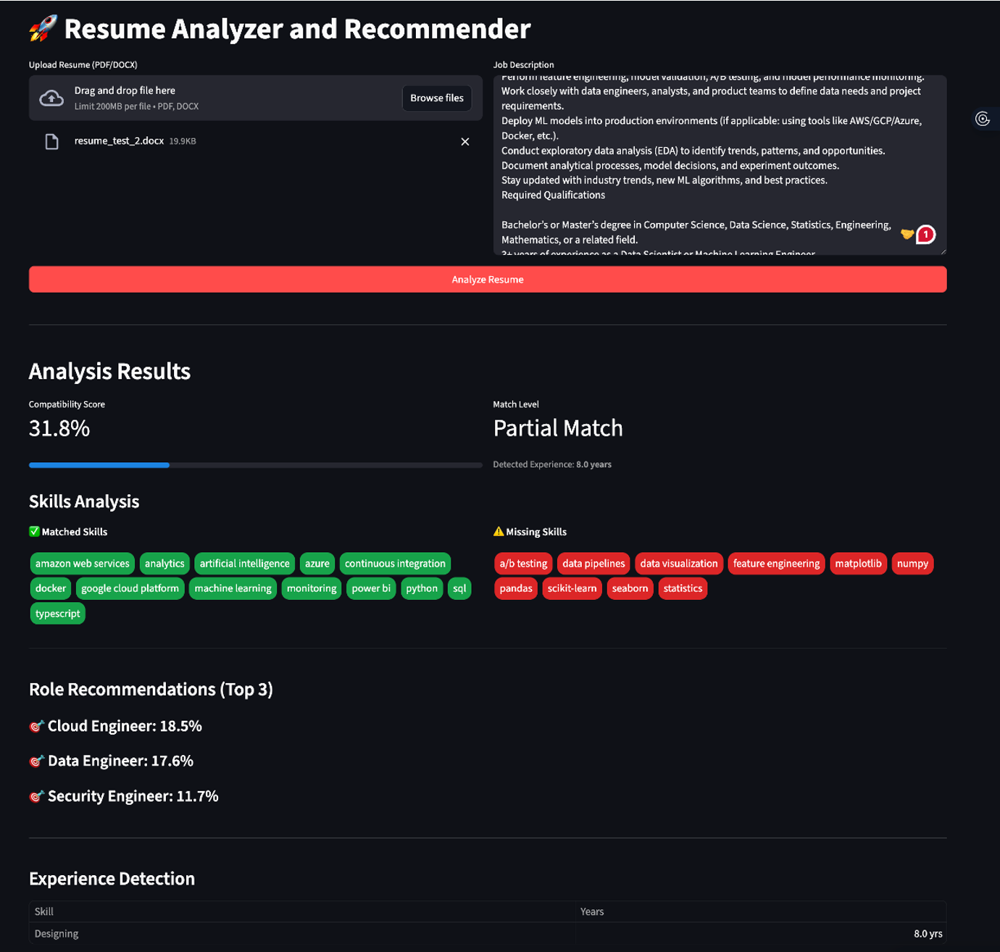

# Smart Resume Analyzer & Job Recommendation System



## Stack
- Backend: FastAPI
- Frontend: Streamlit
- Database: MongoDB
- NLP/ML: spaCy, scikit-learn, TF-IDF + cosine similarity

## Prerequisites
- **Python 3.9+** (Recommended: 3.9 - 3.13)
- MongoDB running locally (or a URI you control)
- spaCy model `en_core_web_sm` (install step below)

## Setup
```bash
python -m venv .venv
source .venv/bin/activate  # Windows: .venv\Scripts\activate
pip install -r requirements.txt
python -m spacy download en_core_web_sm
```

## Configuration
- Env vars (optional):
  - `MONGODB_URI` (default `mongodb://localhost:27017`)
  - `MONGODB_DB` (default `smart_resume`)
  - `API_URL` (Streamlit uses this; default `http://localhost:8000`)

## Run MongoDB
- Local service: `sudo systemctl start mongod` (Linux) or `brew services start mongodb-community` (macOS)
- Docker: `docker run -d --name resume-mongo -p 27017:27017 mongo:6`

## Start the backend (FastAPI)
```bash
uvicorn main:app --reload
```
The app seeds `jobs` collection from `seed_jobs.json` on startup if empty.

## Start the frontend (Streamlit)
```bash
streamlit run app.py
```
Open the provided local URL (usually `http://localhost:8501`).

## Usage
1) Upload a resume (PDF/DOCX, <= 2MB).
2) Paste a job description (<= 5000 chars).
3) Click **Analyze Resume**.
   - **Frontend**: Shows Compatibility Score, Match Level, and Experience.
   - **Backend Terminal**: Prints a detailed **Analysis Report** (showing TF-IDF/BM25 breakdown, Quality Score, etc.).

## Key Features (Tier 2 Improvements)
- **Hybrid Scoring**: Combines TF-IDF (30%), BM25 (45%), and Jaccard (25%) for robust matching.
- **Section Parsing**: Smartly weights "Skills" and "Experience" sections higher than others.
- **Repetition Penalty**: Detects and penalizes keyword stuffing (spam).
- **Experience Extraction**: Extracts years of experience per skill and calculates seniority bonuses.
- **Dynamic Normalization**: BM25 scores are normalized against a "perfect match" self-score.
- **Backend Logging**: Generates detailed text reports in the server logs for deeper analysis.

## File overview
- `main.py` — FastAPI API (`/upload_resume`, `/analyze_v2`), backend logging.
- `app.py` — Streamlit UI.
- `utils.py` — Hybrid scoring engine, parsing logic, normalizers.
- `database.py` — Mongo connection helpers, seeding.
- `seed_jobs.json` — 20 benchmark roles for background corpus and recommendations.
- `requirements.txt` — dependencies.
