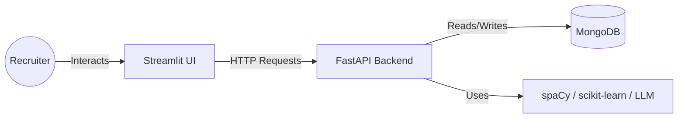

# Technical Specification: AI-Driven Resume Analyzer

## 1. Problem Overview
Recruiters currently face significant challenges in manually screening thousands of resumes. This process is time-consuming, inconsistent, and prone to bias. The goal of this project is to build an intelligent, local-first system that automates the initial screening process by analyzing resumes against job descriptions, extracting key skills, and providing compatibility scores and job recommendations.

## 2. User Flow
```mermaid
graph TD
    A[Start] --> B[Upload Resume (PDF/DOCX)]
    B --> C[Input Job Description]
    C --> D[Click 'Analyze']
    D --> E{Processing}
    E -->|Parse Resume| F[Extract Skills & Experience]
    E -->|Parse Job| G[Extract Required Skills]
    F & G --> H[Calculate Compatibility Score]
    H --> I[Display Results]
    I --> J[Show Compatibility %]
    I --> K[Show Missing Skills]
    I --> L[Recommend Alternative Roles]
    I --> M[Save Profile to Database]
```

## 3. System Architecture
The system will be a local web application composed of three main layers:

*   **Frontend**: Streamlit (Python) for the user interface.
*   **Backend**: FastAPI (Python) for business logic, resume parsing, and scoring.
*   **Database**: MongoDB for storing candidate profiles and job data.
*   **AI/ML Engine**:
    *   `spaCy`: For Named Entity Recognition (NER) to extract skills and experience.
    *   `scikit-learn`: For TF-IDF/Cosine Similarity scoring.
    *   `LLM (Optional/Integrated)`: For generating role recommendations and advanced matching.



## 4. MongoDB Schema Design

### Collection: `candidates`
Stores parsed candidate information.
```json
{
  "_id": "ObjectId",
  "name": "String",
  "email": "String",
  "phone": "String",
  "skills": ["String"],
  "experience_years": "Float",
  "education": "String",
  "resume_text": "String",
  "parsed_at": "DateTime"
}
```

### Collection: `jobs`
Stores job descriptions for matching.
```json
{
  "_id": "ObjectId",
  "title": "String",
  "department": "String",
  "description": "String",
  "required_skills": ["String"],
  "created_at": "DateTime"
}
```

### Collection: `analysis_results` (Optional)
Stores the history of matches.
```json
{
  "_id": "ObjectId",
  "candidate_id": "ObjectId",
  "job_id": "ObjectId",
  "compatibility_score": "Float",
  "missing_skills": ["String"],
  "recommended_roles": ["String"],
  "timestamp": "DateTime"
}
```

## 5. API Design

### Resume Operations
*   `POST /api/v1/resumes/upload`
    *   **Input**: File (PDF/DOCX)
    *   **Output**: JSON object with parsed data (skills, name, etc.) and `candidate_id`.

### Analysis Operations
*   `POST /api/v1/analysis/match`
    *   **Input**: `{ "candidate_id": "...", "job_description": "..." }`
    *   **Output**:
        ```json
        {
          "score": 0.85,
          "matched_skills": ["Python", "SQL"],
          "missing_skills": ["AWS"],
          "recommendations": ["Data Analyst", "Backend Engineer"]
        }
        ```

## 6. Streamlit UI Wireframe
The UI will be a single-page application with a sidebar for navigation (if needed) or a clean vertical layout.

**Layout:**
1.  **Header**: "AI Resume Analyzer"
2.  **Input Section**:
    *   Two columns:
        *   **Left**: File Uploader ("Upload Resume")
        *   **Right**: Text Area ("Paste Job Description")
3.  **Action**: "Analyze Compatibility" Button.
4.  **Results Section** (appears after analysis):
    *   **Score Card**: Large metric showing Compatibility % (e.g., 85%).
    *   **Skills Breakdown**:
        *   Green tags for Matched Skills.
        *   Red tags for Missing Skills.
    *   **Recommendations**: "Based on this profile, this candidate is also a 95% fit for [Role A] and 80% fit for [Role B]."
5.  **Database View** (Tab 2):
    *   Table displaying recently uploaded candidates.

## 7. Technology Stack
*   **Language**: Python 3.10+
*   **Web Framework**: Streamlit
*   **API Framework**: FastAPI
*   **Database**: MongoDB Community Edition
*   **NLP/ML**: spaCy, scikit-learn, PyPDF2/pdfminer
*   **Linting/Formatting**: Ruff
