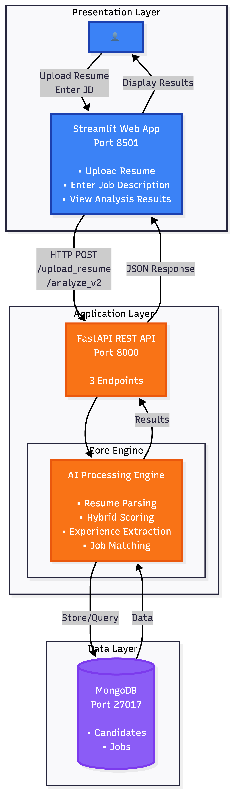

# Technical Specification: Smart Resume Analyzer & Job Recommendation System

## 1. Overview
The **Smart Resume Analyzer** is a local-first web application designed to help users optimize their resumes for specific job descriptions. It leverages Natural Language Processing (NLP) to parse resumes, extract key entities (names, emails, skills), and compute similarity scores against job descriptions. It also provides role recommendations based on a seeded database of common tech roles.

## 2. System Architecture

The system follows a standard 3-tier architecture:
1.  **Frontend**: Streamlit (Python-based UI)
2.  **Backend**: FastAPI (Python REST API)
3.  **Database**: MongoDB (Document Store)



## 3. Component Details

### 3.1 Frontend (Streamlit)
-   **File**: `app.py`
-   **Port**: Default `8501`
-   **Responsibilities**:
    -   File Upload (PDF/DOCX)
    -   Job Description Input form
    -   Displaying Analysis Results (Score, Skills Match/Gap)
    -   Visualizing Role Recommendations

### 3.2 Backend (FastAPI)
-   **File**: `main.py`
-   **Port**: Default `8000`
-   **Responsibilities**:
    -   **Parsing**: Extracts text and entities from resumes (`utils.py`).
    -   **Analysis**: Computes TF-IDF Cosine Similarity between Resume and JD.
    -   **Data Persistence**: Stores candidates and seeds job roles.
    -   **Endpoints**:
        -   `POST /upload_resume`: Upload and parse resume.
        -   `POST /analyze`: Compare resume text against a JD.

### 3.3 Database (MongoDB)
-   **Database Name**: `smart_resume` (configurable via `MONGODB_DB`)
-   **Collections**:
    -   `candidates`: Stores parsed resume data.
    -   `jobs`: Stores seeded job roles for recommendations.

## 4. Data Models

### 4.1 Candidate Object (MongoDB `candidates` collection)
```json
{
  "_id": "ObjectId",
  "name": "String",
  "email": "String",
  "skills": ["String"],
  "resume_text": "String"
}
```

### 4.2 Job Object (MongoDB `jobs` collection)
```json
{
  "_id": "ObjectId",
  "role": "String",
  "description": "String",
  "ideal_skills": ["String"]
}
```

## 5. API Specification

### 5.1 Upload Resume
-   **Endpoint**: `POST /upload_resume`
-   **Input**: `multipart/form-data` with file (PDF or DOCX).
-   **Output**:
    ```json
    {
      "id": "candidate_id",
      "parsed": {
        "name": "...",
        "email": "...",
        "skills": ["..."],
        "resume_text": "..."
      },
      "message": "Resume parsed and stored"
    }
    ```

### 5.2 Analyze Compatibility (V2)
-   **Endpoint**: `POST /analyze_v2`
-   **Input**:
    ```json
    {
      "resume_text": "Extracted text...",
      "job_description_text": "Target job description..."
    }
    ```
-   **Output**:
    ```json
    {
      "compatibility_score": 85.5,
      "match_level": "High Match",
      "matched_skills": ["python", "docker"],
      "missing_skills": ["kubernetes", "aws"],
      "recommendations": [...],
      "total_experience_years": 5.0,
      "skill_experience": {"python": 5.0},
      "sections_detected": ["skills", "experience", "projects"],
      "repetition_penalty": 1.0,
      "score_breakdown": {
          "tfidf": 80.0,
          "bm25": 85.0,
          "jaccard": 90.0,
          "hybrid_raw": 82.5,
          "experience_bonus": 3.0,
          "final": 85.5
      }
    }
    ```

## 6. Logic & Algorithms (Tier 2 Engine)

The system uses a **weighted hybrid scoring V2** approach:

1.  **Section-Aware Parsing**: 
    -   Splits resume into weighted sections (Skills=3.0x, Experience=2.0x, Others=0.5x).
2.  **Hybrid Similarity Calculation**:
    -   **BM25 (45%)**: Context-aware keyword matching, normalized dynamically against a "perfect match" self-score.
    -   **TF-IDF (30%)**: Cosine similarity for general context and vocabulary overlap.
    -   **Jaccard (25%)**: Exact hard skill overlap ratio.
3.  **Refinements**:
    -   **Repetition Penalty**: Detects keyword stuffing (e.g., repeating "Java" 50 times) and applies a multiplier penalty (0.5x - 1.0x).
    -   **Experience Bonus**: Adds score boosters (+3% to +8%) for verified years of experience.
    -   **Corpus Expansion**: Uses `seed_jobs.json` as a background corpus to ensure BM25 IDF scores are statistically valid.

## 7. System Thresholds & Constants

The following thresholds define the system's decision-making logic:

### 7.1 Match Levels
| Score Range | Level |
| :--- | :--- |
| **70% - 100%** | High Match |
| **50% - 69%** | Good Match |
| **30% - 49%** | Partial Match |
| **0% - 29%** | Needs Improvement |

### 7.2 Scoring Weights (Hybrid V2)
- **BM25**: 45% (Weight: 0.45)
- **TF-IDF**: 30% (Weight: 0.30)
- **Jaccard**: 25% (Weight: 0.25)

### 7.3 Section Weights
- **Skills**: 3.0x
- **Experience / Projects**: 2.0x
- **Certifications / Summary**: 1.5x
- **Education**: 1.0x
- **Other**: 0.5x

### 7.4 Bonuses & Penalties
- **Experience Bonus**:
    - 3-5 Years: +3%
    - 6-9 Years: +5%
    - 10+ Years: +8%
- **Repetition Penalty**:
    - Keyword Frequency > 5%: Penalty Factor up to 0.5x (50% reduction)
- **Recommendation Threshold**:
    - Jobs must have **>= 10% compatibility** to be recommended.

## 8. Setup & Run Instructions

### Prerequisites
-   **Python 3.9+** (Recommended: 3.9 - 3.11)
-   MongoDB (running locally on port 27017)
-   spaCy English Model (`en_core_web_sm`)

### Installation
1.  **Clone/Open Project**
2.  **Create Virtual Environment**:
    ```bash
    python -m venv .venv
    source .venv/bin/activate
    ```
3.  **Install Dependencies**:
    ```bash
    pip install -r requirements.txt
    ```
4.  **Download NLP Model**:
    ```bash
    python -m spacy download en_core_web_sm
    ```

### Running the Application

**Step 1: Start MongoDB**
Ensure MongoDB is running.
-   Mac: `brew services start mongodb-community`
-   Docker: `docker run -d -p 27017:27017 mongo`

**Step 2: Start Backend**
```bash
uvicorn main:app --reload
```
*Server will start at `http://127.0.0.1:8000`*

**Step 3: Start Frontend**
Open a new terminal, activate venv, and run:
```bash
streamlit run app.py
```
*App will open at `http://localhost:8501`*
